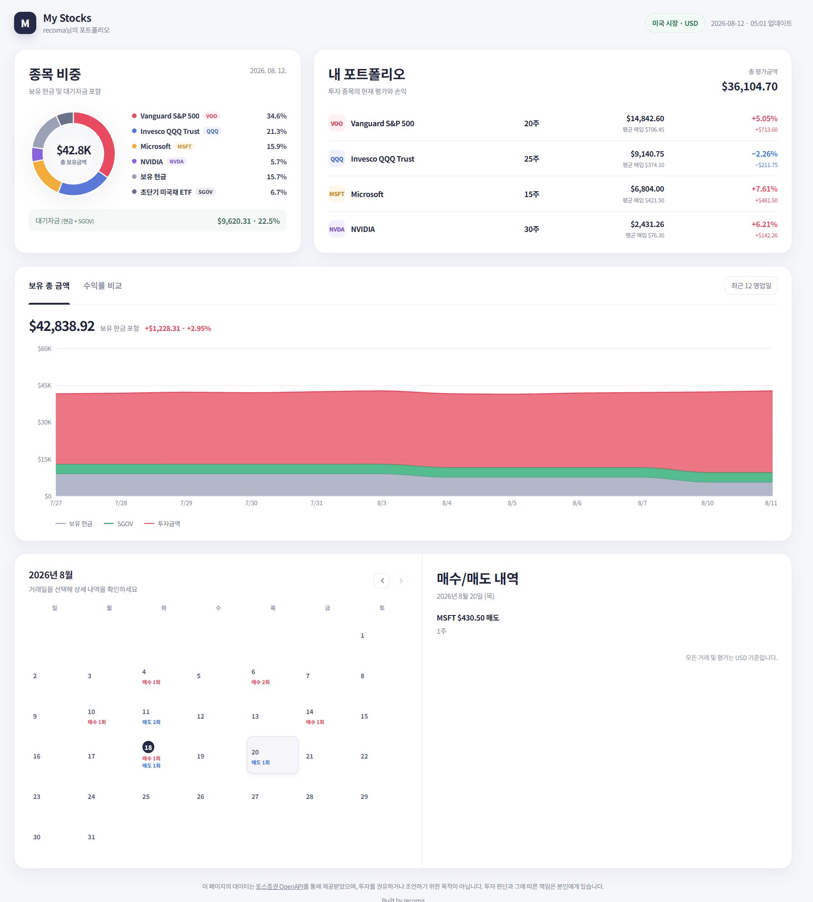
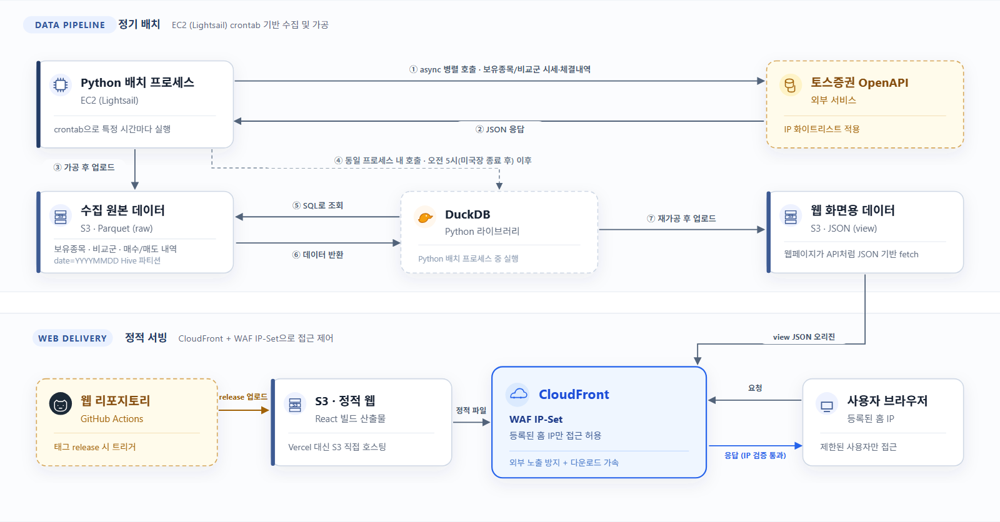

# MyStocks — 개인 투자 포트폴리오 자동 수집·분석 대시보드

> 해당 페이지에 있는 투자 정보는 실제 투자금이 아닌 가상의 데이터입니다.



토스증권 계좌의 보유 종목, 수익률, 매수/매도 내역을 주기적으로 수집해 S3에 적재하고, 이를 가공해 웹 대시보드로 보여주는 개인용 서비스입니다. 이 저장소는 데이터 수집·적재·배치 인프라를 담당하고, 이를 시각화하는 React 기반 웹 프론트엔드는 별도 저장소에서 관리됩니다.


- **개발 기간**: 1주 (2026-08-08 ~ 2026-08-14), 이후 유지보수 및 개선 진행 중
- **개인 프로젝트**

## 개요

증권사 앱은 현재 시점의 수익률/수익금만 보여줄 뿐, 과거 시점 대비 추이나 "현금 포함 계좌 전체 기준" 수익률은 확인할 수 없습니다. 이 프로젝트는 투자 데이터를 주기적으로 원본 그대로 쌓아두고, 나중에 DuckDB 같은 도구로 원하는 방식의 분석을 언제든 추가할 수 있는 구조를 만드는 데서 시작했습니다.

동시에 다음 두 가지가 처음부터 중요한 제약 조건이었습니다.

- **개인 투자 정보 보호**: 보유 종목 등 데이터가 외부에 노출되지 않도록, 웹페이지와 데이터 접근을 허용된 IP로만 제한해야 했습니다.
- **AWS 비용 최소화**: 이후 다른 개인 프로젝트에 AWS 비용 여력을 남겨야 했기 때문에, 인프라 비용과 구조 복잡도를 최소화하는 것이 최우선 목표 중 하나였습니다.

## 주요 기능

- **현재 구성 종목 및 비중, 수익률·수익금** — 보유 종목별 비중, 평가금액, 수익률/수익금을 한눈에 확인
- **과거부터 현재까지의 총 보유 금액(현금 포함) 대비 수익률/수익금** — 증권사 앱이 보여주지 않는 "계좌 전체 기준" 수익률을 시계열로 누적해서 확인
- **지수 추종(S&P, 나스닥) ETF와 수익률 비교 그래프** — VOO(S&P500), QQQ(나스닥100) 등과 내 계좌 수익률을 비교해 시장 대비 성과 판단
- **월별 매수/매도 내역** — 체결 내역을 월 단위로 정리

## 시스템 아키텍처



1. **정기 배치 (EC2 Lightsail, crontab)**: Python 배치 프로세스가 정해진 주기로 실행되어 토스증권 OpenAPI를 async로 병렬 호출합니다 — 보유 종목, 수익률, 비교군(VOO/QQQ/QLD) 시세, 체결 내역을 한 번에 조회합니다.
2. 조회한 데이터를 가공한 뒤 S3에 **Parquet** 형식으로 적재합니다 (`date=YYYYMMDD` Hive 파티션).
3. 미국장이 종료되는 오전 5시 이후에는 같은 프로세스 안에서 **DuckDB**로 S3의 Parquet 데이터를 SQL로 조회하고, 웹 화면에 쓸 형태로 재가공해 S3에 **JSON(view)** 으로 올립니다.
4. 웹 프론트엔드는 별도 저장소에서 관리되며, 태그 release 시 GitHub Actions로 빌드 결과물을 S3에 업로드합니다.
5. 정적 웹 파일과 view JSON 모두 **CloudFront**를 오리진으로 거쳐 서빙되고, **WAF IP Set**으로 등록된 IP만 접근을 허용합니다. S3는 퍼블릭 액세스를 막고 CloudFront를 통한 접근만 허용합니다.

## 기술적 의사결정

**RDS/DynamoDB 대신 S3 + Parquet + DuckDB.** RDS나 DynamoDB는 실제 사용량과 무관하게 인스턴스/처리량을 켜둔 것 자체에 비용을 내는 구조(가동 시간 과금)입니다. 반면 S3는 저장 용량과 실제로 읽은 데이터량에만 비용을 내는 사용량 기반 구조입니다. Parquet은 컬럼 지향 포맷이라 필요한 컬럼만 골라 읽을 수 있고(컬럼 프루닝), 같은 컬럼의 값끼리 묶여 저장돼 압축률도 높습니다 — 그래서 조회가 잦아지더라도 조회 하나당 읽는 바이트가 작아 비용이 크게 늘지 않습니다. DuckDB는 별도 서버 없이 Python 프로세스 안에서 바로 실행되는 in-process 라이브러리이면서, `httpfs` 확장으로 S3 위의 Parquet 파일을 직접 SQL로 조회할 수 있습니다.

**토스증권 API 호출에 async 사용.** 여러 API를 호출할 때 대부분의 시간이 네트워크 응답을 기다리는 I/O 대기입니다. CPU-bound 작업이었다면 GIL 때문에 멀티스레드가 의미 없고 멀티프로세스는 오버킬이었겠지만, I/O-bound 작업은 대기 시간을 겹쳐 처리할 수 있는 async가 구조적으로 맞는 선택이라 판단했습니다. 다만 현재 동시 호출은 3개뿐이라 순차 실행 대비 실제 개선 폭을 측정하지는 못했습니다 — 호출 수가 늘어나면 실측해볼 계획입니다.

## AI를 활용한 개발

프론트엔드 구현량이 상당할 것으로 예상됐지만, 프로젝트의 핵심 목표는 데이터 파이프라인과 AWS 인프라 구축에 있었기 때문에 React 프론트엔드 개발에는 Codex와 Claude를 개발 보조 도구로 활용했습니다. 두 도구를 나눠 쓴 데는 거창한 원칙보다 현실적인 이유가 컸습니다 — 토큰 사용량을 분산하고, 경험상 요구사항 해석·설계는 Codex가 더 명확했던 반면 Claude는 평소에도 코딩 위주로 써왔기 때문입니다. 진행은 (1) Codex로 HTML 기반 UI 프로토타입 제작 → (2) Claude로 React 초기 구조·컴포넌트 구현 → (3) 직접 테스트하며 문제 원인을 파악하고, 필요한 경우에만 범위를 좁혀 LLM에 위임하는 순서로 진행했습니다.

## 문제와 해결 과정

**외부 API의 IP 제한으로 인한 배치 실행 인프라 변경.** 초기엔 실행 시간에만 비용을 내는 Lambda Container 기반 서버리스 구조를 구축했으나, 토스증권 API가 요구하는 "고정 IP 등록" 요건과 Lambda의 유동 IP가 맞지 않았습니다. VPC + NAT Gateway로 고정 IP를 확보하는 방안도 검토했지만, 추가 비용과 관리 포인트가 개인 프로젝트 규모에 비해 과했습니다. 결국 서버리스 대신 **Lightsail + Static IP + crontab**으로 전환해, 별도 네트워크 인프라 없이 고정 IP 요건을 해결하고 월 약 $7 수준으로 운영하고 있습니다. 최소 비용만을 목표로 서버리스를 고집하기보다, 외부 제약과 프로젝트 규모를 고려해 비용·복잡도·운영 편의성의 균형이 더 좋은 구조를 선택한 사례입니다.

**개인 투자 정보 보호를 위한 접근 제어.** Vercel/Netlify 배포도 검토했지만, IP 기반 접근 제어가 요금제 제약을 받는 데다 프론트엔드와 S3 데이터의 접근 제어를 서로 다른 플랫폼에서 따로 관리해야 하는 문제가 있었습니다. 그래서 정적 웹과 view JSON 모두 **S3 → CloudFront → WAF** 구조로 통일하고, WAF IP Set에 등록된 IP만 접근을 허용하도록 구성했습니다. 별도 인증 서버 없이 네트워크 계층에서 일관되게 접근을 통제할 수 있게 됐고, 등록되지 않은 IP에서는 403으로 차단되는 것을 확인했습니다.

**휴장일 데이터 조회 실패 처리.** 당일 S3 view 파일이 없을 때 404가 반환될 것으로 가정하고 전일 데이터로 fallback하는 로직을 짰지만, 실제로는 403 Forbidden이 반환되고 있어 fallback이 동작하지 않았습니다. 브라우저 네트워크 요청을 직접 확인해 원인을 파악한 뒤, 403도 데이터 부재로 처리하도록 수정했습니다. AI가 생성한 코드의 가정을 그대로 신뢰하지 않고 실제 HTTP 응답을 확인해 원인을 분석한 사례입니다.

## 결과, 한계, 다음 계획

**결과**: 투자 데이터 자동 수집, S3 기반 데이터 축적, 일별 포트폴리오 집계, 웹 대시보드 운영이 실제로 작동 중입니다.

**한계**
- 개장일 사이에 휴장일이 낀 경우 등 일부 외부 API 예외 처리가 부족합니다.
- 현재는 10분 간격 재시도로만 장애에 대응하고 있어, 더 정교한 Retry/장애 복구 전략이 필요합니다.
- 테스트 커버리지가 아직 미흡합니다.
- CloudWatch 등 모니터링/알림 체계가 부족합니다 (현재 EC2 로컬 로그 파일에 의존).

**다음 계획**: 재시도·장애 복구 전략 개선 → CloudWatch 모니터링 강화 → 테스트 커버리지 보강 순으로 진행할 예정입니다.

## How To Use

### Installation

이 프로젝트는 [uv](https://docs.astral.sh/uv/)로 의존성을 관리합니다. Python 3.14 이상이 필요합니다 (uv가 자동으로 설치/관리합니다).

환경변수는 `.env.example`를 확인하여, 직접 추가하거나 최상위 루트에 `.env` 파일에 추가하면 됩니다.

```shell
# uv 설치 (아직 설치하지 않았다면)
$ curl -LsSf https://astral.sh/uv/install.sh | sh   # macOS/Linux
$ powershell -c "irm https://astral.sh/uv/install.ps1 | iex"   # Windows

# 의존성 설치 (가상환경은 .venv 에 자동 생성됨)
$ uv sync
```

### Run in Dev

```shell
# handler()를 실행하는 엔트리포인트
$ uv run exec
```

`exec`는 [pyproject.toml](pyproject.toml)의 `[project.scripts]`에 정의되어 있으며, [src/mystocks_data_collector/__init__.py](src/mystocks_data_collector/__init__.py)의 `main()`을 실행합니다.

### Run Test Codes

```shell
# pytest로 테스트 실행
$ uv run pytest

# 또는 등록된 스크립트로 실행
$ uv run test
```

## License

[MIT](LICENSE)
